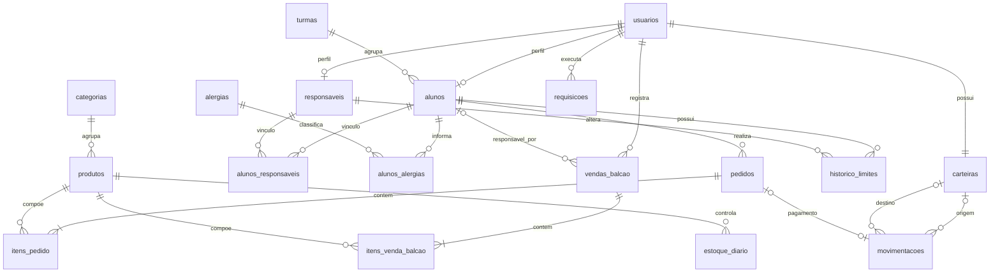

# Banco de dados da cantina

MySQL, InnoDB e utf8mb4. PK identifica o registro; FK referencia outra tabela.
Os comandos executáveis e todas as restrições estão em `banco/cantina.sql`.

| Tabela | Campos |
|---|---|
| usuarios | id_usuario (PK), nome, login (único), email, senha_hash, tipo_usuario (`aluno`, `responsavel`, `cantineiro`), criado_em |
| turmas | id_turma (PK), nome, ano_letivo; nome + ano são únicos |
| alunos | id_aluno (PK), id_usuario (FK, único), id_turma (FK), data_nascimento, limite_gasto, periodo_limite |
| responsaveis | id_responsavel (PK), id_usuario (FK, único), telefone |
| alunos_responsaveis | id_aluno (PK/FK), id_responsavel (PK/FK), parentesco |
| alergias | id_alergia (PK), nome (único) |
| alunos_alergias | id_aluno (PK/FK), id_alergia (PK/FK) |
| categorias | id_categoria (PK), nome ENUM (`salgados`, `doces`, `bebidas`) |
| produtos | id_produto (PK), id_categoria (FK), nome, descricao, ingredientes, preco, icone, ativo |
| estoque_diario | id_produto (PK/FK), data_estoque (PK), quantidade_total, quantidade_vendida |
| carteiras | id_carteira (PK), id_usuario (FK, único), saldo |
| pedidos | id_pedido (PK), id_aluno (FK), criado_em, data_retirada, hora_retirada, valor_total, status |
| itens_pedido | id_item_pedido (PK), id_pedido (FK), id_produto (FK), nome_produto, quantidade, preco_unitario |
| movimentacoes | id_movimentacao (PK), id_carteira_origem (FK, opcional), id_carteira_destino (FK, opcional), id_pedido (FK, opcional/único), tipo, valor, descricao, criado_em |
| historico_limites | id_historico (PK), id_aluno (FK), id_responsavel (FK), valor_anterior, valor_novo, alterado_em |
| requisicoes | id_usuario (PK/FK), chave (PK), acao, resposta JSON, criado_em |
| vendas_balcao | id_venda (PK), id_usuario (FK), id_aluno (FK, opcional), cliente, observacao, data_venda, pagamento, valor_total, criado_em |
| itens_venda_balcao | id_item (PK), id_venda (FK), id_produto (FK), nome_produto, quantidade, preco_unitario |

O núcleo de 13 tabelas e os valores enumerados partem de `Hackathon2.mwb`. `carteiras`,
`historico_limites`, `requisicoes` e as tabelas de venda balcão são extensões das
interfaces. `requisicoes` evita duplicações e a chave é verificada na mesma transação.

## Valores e histórico

Valores monetários são `DECIMAL(10,2)` no banco e centavos inteiros nos cálculos PHP.
O subtotal é calculado, não armazenado. O preço e o nome na tabela de itens preservam
o que foi comprado, mesmo que o cadastro do produto mude depois.

Recarga fictícia: destino preenchido. Transferência: origem e destino preenchidos.
Compra: origem e pedido preenchidos. Uma transferência é uma movimentação única,
vista como saída na origem e entrada no destino.

O saldo escolar é atualizado junto com a movimentação em uma transação. As carteiras são
bloqueadas com `FOR UPDATE` antes de validar e alterar o valor. Compras bloqueiam
também o registro do aluno para coordenar o limite diário com outras operações.

`NULL` em limite significa sem limite. Valor zero impede novas compras. Alterações
de limite ficam em tabela separada porque não movimentam dinheiro.

As FKs restringem exclusões que quebrariam o histórico. A aplicação não oferece
exclusão de contas ou pedidos. Restrições de perfil e autorização são verificadas no
backend: ter um ID válido não concede acesso aos dados de outro usuário.

Vendas de balcão guardam forma de pagamento e preço no momento da venda; não alteram
o saldo das carteiras escolares.

`produtos.ingredientes` guarda os ingredientes e alergênicos em texto. O catálogo online
compara esse campo com as alergias do aluno e a API repete a validação no fechamento.
`estoque_diario` compartilha o estoque entre encomendas online e vendas presenciais.
`vendas_balcao.id_aluno` permite somar os valores `pendente` por aluno: o teto de
inadimplência é R$ 250,00. Ao alcançar o teto ou ultrapassá-lo com uma nova venda,
somente pagamentos imediatos em Pix ou dinheiro são aceitos.
